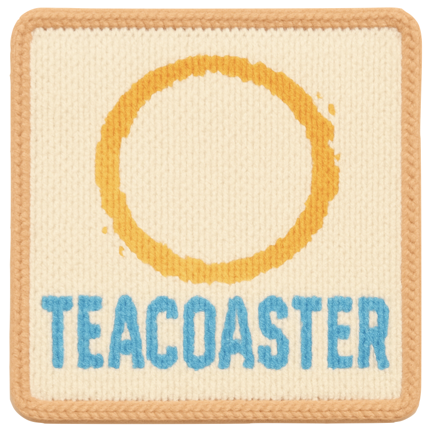

<!--
This README describes the package. If you publish this package to pub.dev,
this README's contents appear on the landing page for your package.

For information about how to write a good package README, see the guide for
[writing package pages](https://dart.dev/tools/pub/writing-package-pages).

For general information about developing packages, see the Dart guide for
[creating packages](https://dart.dev/guides/libraries/create-packages)
and the Flutter guide for
[developing packages and plugins](https://flutter.dev/to/develop-packages).
-->

# TEA Coaster

<div style="display: flex; align-items: center;">
    
    <div style="margin-left: 20px;">TEA <span style="background-color: #f6e5c9; padding: 2px 4px; border-radius: 4px;">Coaster</span> is a Flutter package that implements The Elm Architecture (TEA) pattern, bringing the elegance of Elm's architecture to Flutter development.</div>
</div>


## Features

- Model-View-Update (MVU) architecture pattern
- Command pattern for side effects
- Subscription system for event handling


## Getting Started

Add the package to your `pubspec.yaml`:

```yaml
dependencies:
  coaster: ^0.0.1
```

## Usage

TODO: Include short and useful examples for package users. Add longer examples
to `/example` folder.

```dart
const like = 'sample';
```

## Additional information

TODO: Tell users more about the package: where to find more information, how to
contribute to the package, how to file issues, what response they can expect
from the package authors, and more.
